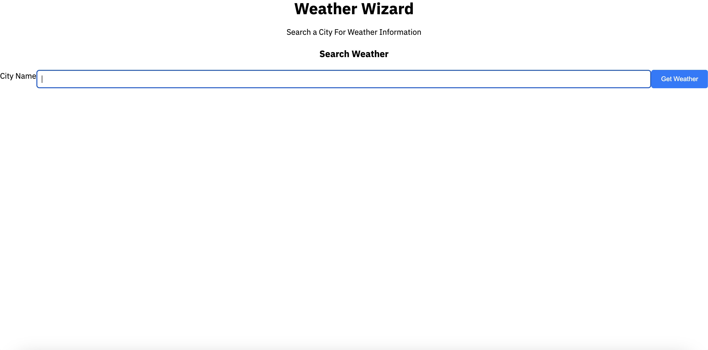

# weather-wizard

## Technology Used 

| Technology Used | Resource URL | 
| ------------- |:-------------:| 
| HTML | [https://developer.mozilla.org/en-US/docs/Web/HTML](https://developer.mozilla.org/en-US/docs/Web/HTML) | 
| CSS | [https://developer.mozilla.org/en-US/docs/Web/CSS](https://developer.mozilla.org/en-US/docs/Web/CSS) | 
| Git | [https://git-scm.com/](https://git-scm.com/) | 

## Description 
In this project I created a weather web application displaying a 5 day forecast for a given city with the ability to recall past searches for display from local storage.

[Visit the Deployed Site](https://armand57araujo.github.io/busy-bees-need-schedules/)

## Code Example 

 
const API_KEY = '5968b859cc10d7e72cd116fba774bb27';
const BASE_URL = "https://api.openweathermap.org"
const searchForm = document.getElementById('searchForm');
const cityInput = document.getElementById('cityInput');
const forecastCardsContainer = document.getElementById('weatherInfo');
const searchHistory = document.getElementById('searchHistory');
const searchHistoryContainer = document.getElementById('searchHistory');

function getForecost(lat, lon) {
    //const apiUrl = `https://api.openweathermap.org/data/2.5/forecast?lat=${lat}&lon=${lon}&appid=${API_KEY}`;

    const apiUrl = `https://api.openweathermap.org/data/3.0/onecall?lat=${lat}&lon=${lon}&appid=${API_KEY}`
    fetch(apiUrl)
        .then(response => response.json())
        .then(data => {
            console.log(data)

            for (let i = 0; i < data.list.length; i = i + 8) {
                console.log("day", data.list[i]);
                //const weatherCard = document.getElementById('weatherInfo');
                const card = document.createElement('div');

                card.classList.add('card');

                card.innerHTML = `

I thought I had a handle on the challenges, but this project was by far the most ontense challenge I've endeavored in so far. From traversing the DOM to apending the data from the server side API data to the page was difficult and strenuous, leaving m numerous times banging my head agaianst the wall.

      unction getWeather(city) {
    const apiUrl = `https://api.openweathermap.org/data/2.5/weather?q=${city}&appid=${API_KEY}&units=metric`;

    fetch(apiUrl)
        .then(response => response.json())
        .then(data => {
            const { name, main, wind, weather } = data;
            const temperature = main.temp;
            const humidity = main.humidity;
            const windSpeed = wind.speed;
            const icon = weather[0].icon;
            const description = weather[0].description;
            const lat = data.coord.lat;
            const lon = data.coord.lon;
            // console.log(data)
            getForecost(lat, lon)

            weatherInfo.innerHTML = `
<h2>${name}</h2>

Date: ${new Date().toLocaleDateString()}

Weather: ${description}

Temperature: ${temperature}°C

Humidity: ${humidity}%

Wind Speed: ${windSpeed} m/s

`;
        })
        .catch(error => console.error('Error:', error));

}

I was experiencing numerous errors where data was not being caught, defined or displayed to the page. It turns out I wasn't listing the items from the console properly in my JavaScript. Additionally, I couldn't limit the number of buttons that appeared on the page, adding dozens of the buttons without limit. In my Javascript I made it so only the five most recent searches are displayed, repairing the issue.

## Learning Points 

I learned a great deal about using data from server side APIs and showing it on my page. It answered a lot of questions I've always had such as how does every app or websites have unified data displayed across an array of websites. It informs ideas that I have for future ideas.

## Author Info
Armand Araujo
Age: 28
Location: Santa Barbara, CA

 
* [LinkedIn](https://www.linkedin.com/in/armand-araujo-a82ba2291/) 
* [Github](https://github.com/Armand57araujo) 

## Credits 